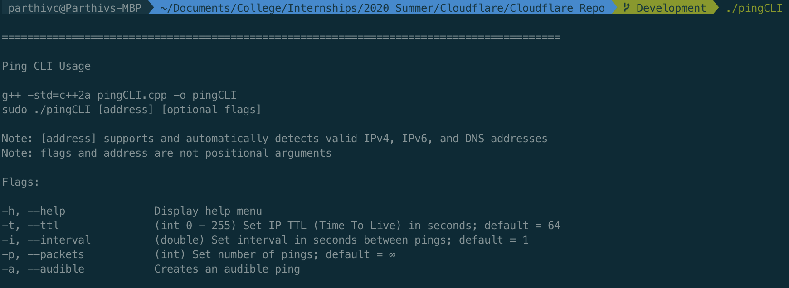

Cloudflare Internship Application 2020 (Software Engineer - Intern: Systems Project)

## Installation

You can download the code for this project by executing the following:
```
git clone https://github.com/MildlyJealousJellyBean/Cloudflare-2020.git
```

This Ping CLI tool was written in C++20, and can be compiled and run by executing the following
```
g++ -std=c++2a pingCLI.cpp -o pingCLI
sudo ./pingCLI [address] [options]
```

## Usage

To see the flags and expected values, you can use the flags `-h`, `--help`, or just run `./pingCLI` to display the help menu:



## How It Works

#### Argument Parser
To reduce the amount of user input necessary, this Ping CLI tool does not require any libraries to be installed or any arguments to be positional (except for the flag arguments, otherwise the flags would be useless). It does this by parsing each available argument, checking for flags, and then evaluating them to ensure they only contain valid values. If flags are enabled but do not contain valid values, the default flag values will be used.

#### IP and DNS Validation
The Ping CLI tool also automatically detects any valid IPv4, IPv6, and DNS addresses. It does this by hastily checking if the input is a DNS address (and attempts to resolve it to an IP address if it is), or if the input is an IPv4 or IPv6 address. It then runs a full ping on the IP address, setting IPv6 parameters accordingly, and ensures that the packet is properly received. If the packet is not received, the non-positional argument is skipped and the argument parser looks for another valid address.

#### Smart Abort
The Ping CLI tool will abort on several conditions:
- The packets flag (`-p`, `--packets`) is used and set to 0
- No valid IP or DNS address is provided
- If the Ping CLI tool is not run as `sudo`

#### Rolling Average
The Ping CLI tool takes a rolling average of the 100 most recent RTT's (Round Trip Times) for each packet sent instead of an overall average for several reasons. Beyond the saved memory, a rolling average can also give an engineer monitoring the console additional information on fluctuations that could be happening with the RTT's. Overall averages would normalize any outliers and become less reflective of RTT change over time, arguably providing less functionality.

#### Post-Ping Statistics
The Ping CLI tool implements a KeyboardInterrupt listener, and calculates the same statistics as the built in system `ping` and `ping6` functions.
